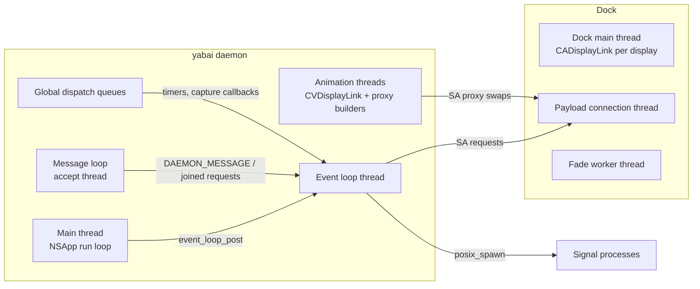

# Architecture

This map describes the daemon, its client and the Dock payload as they stand
on `dev` with the local translation-unit refactor: which components exist,
which thread runs what, how events flow and who owns each piece of state.
It also lists the risks found while drawing the original map. Details of
the fork's own features are in [navigation](NAVIGATION.md),
[effects](EFFECTS.md) and [scripting addition](OSAX.md).

## Components and processes

| Process | Code | Role |
| --- | --- | --- |
| `yabai` daemon | `src/yabai_main.m` and the area units below | Window manager: observes applications, windows, Spaces and displays, tiles, answers commands, runs signals. |
| `yabai -m` client, `yabai-msg` | `src/client/client.c`, shared by `src/yabai.c` and `src/client/yabai_msg.c` | Sends one command over the daemon socket and prints the reply once all of it has arrived. `skhd` and `space.sh` start one per key press. `yabai-msg` is the same client alone: it links only libSystem and starts in about 2 ms instead of 6. |
| Dock payload | `src/osax/payload.m` and fork handlers | Injected into Dock by `yabai --load-sa` (root, `src/osax/loader.m`). Runs Dock-private operations: Space focus, create, move; window order, level, opacity and fades. |
| Signal actions | `src/events/event_signal*.c` | Shell commands the daemon starts with `posix_spawn` when a subscribed event occurs. Each answers for its own privacy (TCC) permissions instead of inheriting the daemon's Accessibility and Screen Recording. |

The two sockets:

- **Daemon socket** `~/Library/Caches/yabai/daemon.sock`. The directory must
  be a real directory owned by the login user with no group or other access;
  it is created with mode `0700`. The accept thread checks each peer's audit
  token for the owner's effective UID or root and validates the peer against
  this daemon's designated code-signing requirement before parsing. A
  message is a 4-byte length and NUL-separated tokens (`src/ipc/message_loop.c`,
  parsed by `src/ipc/message.c`). The daemon answers on the same connection.
  The event loop reads the request and then writes the reply built in memory,
  within one second each (`src/events/handlers/messages.c`), so a client that
  stalls loses its request or the rest of its reply instead of holding every
  event. A request it cannot read, a peer that fails the requirement, and a
  client arriving while 128 connections wait for the event loop are answered
  with the reason instead of a silent close. The accept thread remembers the
  code-directory hashes that passed the requirement, so a new client process
  of the same build costs a kernel query instead of a signature check
  (`src/osax/socket_identity.h`). The signed client is an ordinary command any
  process of the user can run, so the requirement keeps other programs off
  the socket but is no boundary between processes of the same user. Rule and
  signal patterns whose automaton would cost more than a literal as long as a
  request are refused before `regcomp` runs (`src/ipc/pattern.c`).
- **Payload socket** `~/Library/Caches/yabai/payload.sock` in Dock. The payload
  applies the same directory and audit-token checks. It validates peers
  against a requirement saved by the root installer in its bundle. Each request opens its own connection
  (`scripting_addition_send_bytes`), builds its message in a stack buffer of
  `SA_SOCKET_BUFF_LEN` (4 KiB), the payload's message size, refusing one that
  does not fit, and waits up to one second for Dock to close the connection
  or reply. Dock handles connections one at a time on one
  thread. An explicit local development build may allow unsigned peers;
  the default requires the signed daemon identity. Live verification is still
  required before release.

## Build structure

The daemon is built from separate Objective-C translation units. Each unit
includes `core_prelude.h` for platform and area interfaces, then its own
sources. `core_types.h` supplies platform types to area headers, which also
compile on their own. The current area boundaries are:

```
src/yabai_main.m                  global definitions, startup and shared helpers
src/navigation/navigation_effects.m
                                  navigation and display/window effects
src/sa/sa_unity.m                 scripting-addition client
src/displays/displays.m           display facts and manager
src/applications/applications.m   process table and AX applications
src/spaces/layout_unity.m         Spaces, BSP views, windows and managers
src/events/events.m               event loop, handlers, signals and mouse input
src/ipc/ipc.m                     message parser, seven domains and dispatch
```

`spaces/` and `windows/` remain one translation unit because their view and
window-manager functions call each other heavily. This is a deliberate
intermediate boundary within point 4. `navigation/` and `effects/` also share
one unit because their callbacks and schedule state interact closely. Every
other listed area compiles separately, so cross-unit calls use declarations
in the owning headers and are checked by the compiler.

`src/manifest.m` still includes all production sources in the original order
for `yabai_tests` and the daemon-message fuzzer. It is no longer a source of
the production executable. `yabai_unity_sources()` derives language-server
compile commands from the production units and the Dock payload. The Makefile
uses the same daemon units as CMake.

The shared helpers with external state or implementation have one definition:
the hashtable, temporary storage, memory-pool initializer, notification
delegate and Mach-O symbol lookup are emitted by `yabai_main.m`; their
headers expose declarations to the other units. The scripting-addition client
uses the same temporary storage and notification entry point. The process,
display, Space and window globals remain defined in `yabai.c`, while their
writing threads and readers are listed below. The definition's file does not
imply ownership after startup.

The Dock payload is built separately for x86_64 and arm64
(`src/osax/{x64,arm64}_payload.m`), then embedded in the daemon as
`payload_bin.c` and `loader_bin.c`. Focused tests may include a source
directly with stubs; a successful compile or unit test does not establish
live Dock behavior.
## Threads



### Daemon

| Thread | Started by | Runs | Writes |
| --- | --- | --- | --- |
| Main | `main` → `[NSApp run]` | Carbon process events (`process_handler`), NSWorkspace and distributed notifications and KVO (`workspace.m`), AX observers per application and for Dock (`application.c`, `mission_control.c`), the mouse event tap (`mouse_handler.c`), display reconfiguration (`display_manager.c`), SkyLight connection notifications (`mission_control.c` `connection_handler`), and retries dispatched to the main queue. | The process table (`g_process_manager`), `mouse_state` click flags, `__last_cmd_tab_time` (atomic). KVO updates process policy on the main thread; other callbacks only post events. |
| Event loop | `event_loop_begin` | Every event handler and every daemon command, one at a time (`event_loop_run`). Signals are spawned at the end of each event (`event_signal_flush`). | All window, space, display, view and rule state; all fork navigation state; every SA request of commands and navigation. |
| Message loop | `message_loop_begin` | `accept` on the daemon socket; the fork's grouping of `space --navigate focus next/prev` requests (`space_navigation_accept`). | `g_space_navigation_queue` (mutex). |
| Global queues | `dispatch_after`, `dispatch_source` | Navigation wake-ups, deferred focus and capture deadlines (post events), the snapshot overlay's alpha timer and its cancel handler, ScreenCaptureKit completion (posts an event for a queued step). | Snapshot state under `space_snapshot_lock`; capture bookkeeping under its own mutex. |
| Animation | `window_manager_animate_window_list` | Upstream window animations: proxy windows built on short-lived threads, frames on a CVDisplayLink thread, which also asks Dock to swap proxies back. | Animation contexts and `window_animations_table` under `window_animations_lock`. |

Startup order (`src/yabai.c`): the event loop thread starts first, then the
process, display and mouse managers, the SkyLight notifications, the window
and space managers, the message loop, and finally the configuration file runs
and the main run loop starts. Main-thread callbacks cannot fire before
`[NSApp run]`, so the managers are complete before the first event; the first
commands can arrive as soon as the message loop starts.

### Dock payload

| Thread | Runs |
| --- | --- |
| Payload connection thread | Accepts one daemon connection at a time and handles its message (`handle_connection` in `payload.m`). |
| Fade worker (fork) | One sleeping worker that writes window-fade frames and watches their deadlines (`window_fade_worker.c`). |
| Dock main thread | Fork display links, one per display, created on Dock's main queue; they wake the worker (`window_fade_display.m`). |

Fork payload state is guarded by `window_fade_lock`; display callbacks only
try the lock, so Dock's main thread never waits for the worker.

## Events

Producers post with `event_loop_post`, which copies the event into a ring
under a mutex (`event_queue.c`) and wakes the consumer with a dispatch
semaphore private to the process. A full ring doubles, with a warning in the
log, so an event loop that falls behind costs memory rather than events. A
mouse move replaces the move queued right before it and adds no wake-up of its
own.
The 43 event types (`src/events/event_loop.h`) come from:

| Producer | Events |
| --- | --- |
| Carbon process events (main) | `APPLICATION_LAUNCHED`, `APPLICATION_TERMINATED`, `APPLICATION_FRONT_SWITCHED` |
| NSWorkspace, KVO and distributed notifications (main) | `APPLICATION_LAUNCHED` (once launch finishes), `APPLICATION_VISIBLE/HIDDEN`, `SPACE_CHANGED`, `DISPLAY_CHANGED`, `SYSTEM_WOKE`, `DOCK_DID_RESTART`, `DOCK_DID_CHANGE_PREF`, `MENU_BAR_HIDDEN_CHANGED` |
| AX observers of applications (main) | `WINDOW_CREATED/DESTROYED/FOCUSED/MOVED/RESIZED/MINIMIZED/DEMINIMIZED/TITLE_CHANGED`, `MENU_OPENED/CLOSED` |
| AX observer of Dock (main) | `MISSION_CONTROL_SHOW_ALL_WINDOWS/SHOW_FRONT_WINDOWS/SHOW_DESKTOP`, `MISSION_CONTROL_EXIT` |
| SkyLight notifications (main) | `SLS_WINDOW_ORDERED/DESTROYED`, `SLS_SPACE_CREATED/DESTROYED`, `MISSION_CONTROL_ENTER` |
| Display reconfiguration (main) | `DISPLAY_ADDED/REMOVED/MOVED/RESIZED` |
| Mouse tap (main) | `MOUSE_DOWN/UP/DRAGGED/MOVED` (moves only with `focus_follows_mouse`) |
| Message loop | `DAEMON_MESSAGE` |
| Navigation timers (global queues) | `SPACE_NAVIGATION_FOCUS`, `SPACE_NAVIGATION_DISPATCH`, and `SPACE_NAVIGATION_CAPTURED` at a capture's deadline |
| ScreenCaptureKit completion | `SPACE_NAVIGATION_CAPTURED` |
| Handlers themselves | Directly: `APPLICATION_FRONT_SWITCHED` and `WINDOW_FOCUSED` that arrived before their application or window was known. Through the main queue, 100 ms later: `APPLICATION_LAUNCHED` retries, `MISSION_CONTROL_CHECK_FOR_EXIT`, `MISSION_CONTROL_EXIT`. |

Ordering is FIFO; a merged mouse move keeps the place of the one it
replaced. Object lifetimes rely on it: the main thread posts
`APPLICATION_TERMINATED` after every earlier event about that process, and
only that handler frees it. Handlers taking more than 10 ms emit a signpost
(category `events`, `event_loop_trace.c`).

## State and ownership

| State | Owner | Other access |
| --- | --- | --- |
| `g_window_manager` (windows, applications, focus, opacity, animation settings) | Startup initializes; event loop writes | Animation threads read their own contexts; `window_animations_table` is locked. |
| `g_space_manager`, views and their BSP trees | Startup initializes; event loop writes | — |
| `g_display_manager` | Startup initializes; event loop writes | Display reconfiguration callback only posts. |
| `g_process_manager.process` (table) | Main thread | Event loop receives `struct process *` through events; main-queue retries look processes up on the main thread. |
| `g_process_manager` frontmost-process and switch fields | Event loop | Main-thread process callbacks use the process table, not these fields. |
| `g_mouse_state` | Settings: event loop; click flags: main-thread tap | The tap reads the configured `modifier` atomically. Drag and focus state belongs to the event loop. |
| `g_event_loop` and its queue | Startup initializes; event loop consumes | Main, message and global-queue producers add events under the queue mutex. |
| `g_signal_event` | Event loop | Signal subscriptions and pending actions. |
| `g_signal_storage` | Event loop | Memory backing signal actions. |
| `g_workspace_context` | Main-thread startup | Event handlers and process management use it to observe or unobserve applications. |
| `g_mission_control_mode` | Event loop | Main-thread callbacks only post Mission Control events. |
| `g_cv_host_clock_frequency` | Startup | Animation threads and event-loop window operations read it. |
| `g_layer_normal_window_level`, `g_layer_below_window_level`, `g_layer_above_window_level` | Startup | Window and view code read these display levels. |
| `g_event_bytes` | Startup allocates; event loop writes | Window-focus operations reuse this event buffer. |
| `g_sa_socket_file` | Startup and scripting-addition load set it | Event-loop commands and animation workers read it for Dock requests. |
| `g_socket_file`, `g_config_file`, `g_lock_file` | Startup/client option parsing | The daemon uses these paths during initialization and command acceptance. |
| `g_bs_port` | Startup | Animation notification code reads the bootstrap port. |
| `g_connection` | Startup | Event loop and main-thread callbacks read the SkyLight connection. |
| `g_verbose` | Client option parsing and event-loop config command | Logging on other threads uses an atomic relaxed load. |
| `g_pid` | Startup | Used to acquire the daemon lock. |
| `g_space_navigation_queue` (fork) | Message loop and event loop | Mutex. |
| `g_space_navigation_schedule`, `_focus`, `_anchor`, `_spaces` (fork) | Event loop | Timers only post events. |
| Snapshot (`space_snapshot_active`, recent Spaces) | Event loop creates and cancels | Alpha timer on a global queue, under `space_snapshot_lock`; the timer's cancel handler frees the snapshot without the lock. |
| Capture bookkeeping (`space_snapshot_captures`) | Event loop begins | ScreenCaptureKit completion ends it; own mutex, reference-counted capture. |
| Capture a step waits for (`space_snapshot_pending`, `space_navigation_flight`) | Event loop | ScreenCaptureKit completion and the deadline timer only post `SPACE_NAVIGATION_CAPTURED`; the capture's image is handed over through its semaphore. |
| `__pending_window_focus_id` (fork) | Event loop | Atomic. |

### Callback audit and Dock request ordering

The NSWorkspace, AX, display-reconfiguration and SkyLight callbacks inspected
for point 5 enqueue daemon events. The main-thread process table, KVO policy
field, mouse-tap click flags and atomic Command-Tab timestamp are the explicit
exceptions. KVO now reads the cross-thread `terminated` flag atomically; the
mouse tap reads the event-loop-configured modifier atomically. Logging reads
`g_verbose` atomically. This is a source audit; a live daemon TSan run has not
been performed.

The event loop sends Space-focus and other scripting-addition requests while
animation workers send proxy-swap requests. Separate client connections can
reach Dock in either order, but the payload's single accept loop handles one
complete request at a time. A proxy swap names its window and proxy IDs; a
Space focus names its destination Space. Neither handler uses a partially
decoded state from another request. No cross-thread ordering is required for
payload memory safety. The visible result of a swap racing a Space switch
has not been checked on screen, so visual ordering remains open.

The first-visit performance issue in `window_manager/spaces.c` is still open.
That path lists Space windows, reconciles the BSP view and flushes visible
window frames with AX. Deferring or batching those operations can change
tiling order and focus timing. The planned first-lap `sample` profile has
not run under the current compile-only verification limit, so no scheduling
change is included in this candidate.

## Upstream subsystems

- **Processes and applications** (`applications/process_manager.c`,
  `applications/application.c`, `events/workspace.m`): which applications
  exist, their AX observers and launch state.
- **Windows** (`windows/window/` for observation, Space membership,
  serialization, attributes, properties, identity and lifecycle;
  `windows/rule.c`; `windows/window_manager/` by concern): the window and
  application tables,
  queries, rules, frames, animations with their JankyBorders notifications,
  opacity and layers, lookups, focus, the window commands, the scratchpad, and
  keeping views in step with Space and display changes (`spaces.c`).
- **Spaces and views** (`spaces/space.c`, `spaces/space_manager/` for views,
  labels, layout, selectors, window moves, operations and state;
  `spaces/view/` for feedback, geometry, nodes, directional lookup, operations
  and lifecycle): Desktop queries through SkyLight, one view (layout and BSP
  tree) per Space, Space commands through the payload.
- **Displays** (`displays/display.c`, `displays/display_manager.c`).
- **Commands** (`ipc/`): the parser (`message.c`), one file per domain in
  `commands/` (`config`, `display`, `space`, `window`, `query`, `rule`,
  `signal`), and the socket's accept thread and dispatch (`message_loop.c`).
- **Events** (`events/`): the event loop, domain handlers in `handlers/` and
  its queue, signals
  (`event_signal.c`: subscriptions and spawning), the mouse
  (`mouse_handler.c`: modifier drags, drops and focus follows mouse), Mission
  Control (`mission_control.c`: its modes and the SkyLight notification
  callback) and NSWorkspace notifications (`workspace.m`).
- **Scripting addition** (`sa/sa.m`, `osax/`): install, load, and one request
  function per Dock operation.

## Fork subsystems

Navigation (`space --navigate`), in the order a request travels:

1. **Admission** (`navigation/admission.c`, message loop): recognises
   `focus next|prev` from the raw bytes, groups requests that arrive while one
   waits, tells repeats (under 75 ms) from presses, answers joined requests at
   once.
2. **Command** (`navigation/command.c`, event loop): parses the request,
   takes one snapshot of the Desktops, claims the group's steps and queues.
3. **Schedule** (`navigation/schedule.c`, event loop, pure logic with
   injected clock and executor): bounded queue, rhythm, effect and activation
   waits, overflow jumps, which step activates or settles.
4. **Step** (`navigation/step.c`, event loop): plans (destination, window,
   raise), prepares the effect, asks Dock to switch, starts the effect,
   activates. A queued crossfade step returns after requesting its capture;
   `SPACE_NAVIGATION_CAPTURED`, from the capture's callback or its 150 ms
   deadline, switches and activates, and the schedule starts nothing else
   meanwhile.
5. **Activation** (`navigation/activation.c`, `window_focus_events.c`):
   focus without the upstream 40 ms sleep, raise for applications with windows
   on other displays, the observed focus that spares an AX query.
6. **Topology** (`navigation/topology.c`): one WindowServer snapshot per
   request answers order, display, visibility and type.

Effects:

- **Snapshot crossfade and veil** (`effects/snapshot*.m`): the capture
  (`snapshot_capture.m`), the owned overlay window in an auxiliary Space
  (`snapshot_surface.m`), its alpha timer and cancellation (`snapshot.m`). The
  veil is the same overlay filled with black instead of a capture.
- **Window fade** (`effects/window_fade.c`, `sa_opacity.c`, payload
  `window_fade*.c`): the older per-window fade and the opacity policy.
- **Display facts** (`effects/display.m`): the refresh interval effects are
  timed with, and Reduce Motion.

Diagnostics: signposts in subsystem `com.lcs.yabai`, categories
`navigation`, `events` and `effects`.

## Risks found while mapping

| # | Where | Risk | Severity |
| --- | --- | --- | --- |
| 1 | `space_snapshot_cancel_locked` | Read the snapshot after its cancel handler could free it; crashed lcs.25. | Fixed in lcs.26 |
| 2 | Event queue and signal storage | The events' memory pool wrapped to its start without checking that the consumer was past it: a stall with about 21,000 events posted would have overwritten unread ones. Signals of one event were written without a bound. | Fixed after lcs.28: a ring that grows (`event_queue.c`), consecutive mouse moves merged, a signal that does not fit dropped with a warning |
| 3 | `sa.m` request builders | `pack` never checked the 4 KiB buffer: requests with one entry per window (`move_window_list_to_space`, proxy swaps, `order_window_in`) overflowed the stack past roughly 500 to 1,000 windows. | Fixed after lcs.28: a request that does not fit is refused |
| 4 | Event loop | Everything runs on one thread, and some calls wait for others: on a Space change upstream revalidates windows and sets frames over AX (about 1.1 s of busy time in a 45-second sample of bursts), activation waits for WindowServer (about 40 ms on average over 16 activations), Dock up to 1 s. A paced crossfade no longer waits for its capture; drawing the image and one refresh remain, with the switch and the activation, and with pacing off the capture (up to 150 ms) as well. On two 4K displays (20 Mpx each) with lcs.28 that part held the loop a median 132 ms per step (p90 435 ms). | Performance; bounded by timeouts |
| 5 | Daemon and payload sockets | The local candidate moves both sockets to an owner-only directory and checks peer audit-token UIDs and the daemon's designated requirement before parsing. Unsigned peers require an explicit development build. An unsigned local daemon and payload passed a bounded live smoke on 2026-09-29; the signed release path remains untested. | Security; candidate |
| 6 | TCC | Grants of a bare binary follow its path; every store path asked again and ran without crossfades until restart. | Fixed in Dotfiles `9a8fb78`; the grants survived the update to lcs.28 |
| 7 | Upstream animations and navigation | The CVDisplayLink thread and the event loop both send Dock requests. The payload handles each full request serially, and proxy swaps target window IDs while navigation targets a Space ID. Visible ordering during an overlap remains unverified. | Unverified visual result |
| 8 | Unity build | Hidden coupling through include order and file-static globals, so a module's inputs and threads are not visible where it is used. Navigation and effects now declare their interfaces, threads and state in headers and compile before the core; the core's files still call each other's file-static functions by include order. | Maintainability; reduced |
| 9 | Daemon socket commands | The event loop read requests and wrote replies with blocking calls and no bound, so one stalled client held every event; signal actions inherited the daemon's TCC grants; negative or non-finite durations and ratios were accepted and could leave an animation running forever; a nested or optional-heavy pattern held the event loop for seconds in `regcomp`; refused requests closed silently and the client reported success. See the [IPC audit](reports/IPC-Audit_8.0.0-lcs3.md). | Fixed after lcs.3 |

### First Space visits after restart

On 2026-09-29, a 30-second, 1 ms `sample` of the installed lcs.13 daemon
covered the first visit to Desktops 2–11 after a service restart. The client
command for Desktop 2 took 323 ms; the next commands took 15–111 ms, apart
from Desktop 3 at 72 ms. These are command completion times, not event-handler
or frame-presentation durations. The sample caught a `SPACE_CHANGED` window
validation in which the event loop spent 215 samples waiting for animation
proxy preparation threads. AX frame queries and WindowServer calls also
appear on that path. Startup configuration separately spent 213 samples in
window validation and frame setting. The earlier 0.9-second first-visit stall
did not recur in this lap. Defer batching or moving validation off the event
loop until signposts isolate each first visit and show which work can safely
move without changing window ordering or tiling.

## Upstream integration

`master` mirrors asmvik/yabai. From now on its changes are not merged
wholesale: new commits by Åsmund Vikane (`koekeishiya`, `Åsmund Vikane`) are
reviewed and ported when they add something the fork lacks. Upstream releases
are rare. This frees the refactor from preserving upstream's file layout. Every
Monday the `sync-upstream` workflow fast-forwards `master` and lists the
author's new commits, oldest first, in the open issue labelled `upstream`
(creating it when none is open); close the issue once every commit is
handled. Commits by other contributors are not reported.

## Refactor plan

Goals: explicit module boundaries, the threads each module runs on written in
its header, and seams for tests that do not depend on include order. Each step
keeps behaviour, passes the existing tests and the live burst checks, and
lands as its own commits.

1. Done. **Headers for the fork's modules**, keeping the unity build:
   `navigation/admission`, `navigation/schedule`, `navigation/step`,
   `navigation/activation`, `navigation/topology`, `effects/snapshot`
   (capture and overlay separately), `effects/window_fade`. Each header
   states its thread and the state it owns. Callers in upstream files go
   through one hook header instead of forward declarations.
2. Done. **Split the step** into plan, switch and activate. This is also what
   the asynchronous capture needs: plan and capture start, the capture
   callback posts an event, and switch and activation run from it, so the
   event loop no longer waits for ScreenCaptureKit. Only paced steps capture
   this way; with pacing off a request still waits.
3. Done. **One header for private SkyLight and AX declarations**: the daemon's
   are in `misc/extern.h`; the payload keeps its own in `osax/payload.m`.
4. Done. **Fix risks 2 and 3**: the event queue copies each event into a
   ring under a mutex and doubles it when full, reporting the growth.
   Dropping an event instead would leak what it carries or leave a client
   waiting, and with consecutive mouse moves merged the ring grows only with
   what the user does. `pack` refuses a request that does not fit.
5. Done. **Remove the legacy Space crossfade** from the payload and the
   protocol: payload `2.1.31-lcs.13` drops about 630 lines and opcode `0x16`,
   which stays reserved; loading it needs a scripting-addition reload.
6. Done for the files. **Upstream files where it pays**: `message.c` by
   command domain (`commands/`, byte-identical binary) and `window_manager.c`
   by concern (`window_manager/`, identical LLVM IR for every function and
   global). Left for the efficiency work: the Space-change revalidation that
   holds the event loop (`window_manager/spaces.c`).
7. Done. **Workflow**: `sync-upstream` reports new commits by the author in
   an issue instead of proposing a merge.

Order: 1 and 3 first (mechanical, low risk), then 2 with the asynchronous
capture, then 4 and 5, then 6 as findings justify.
