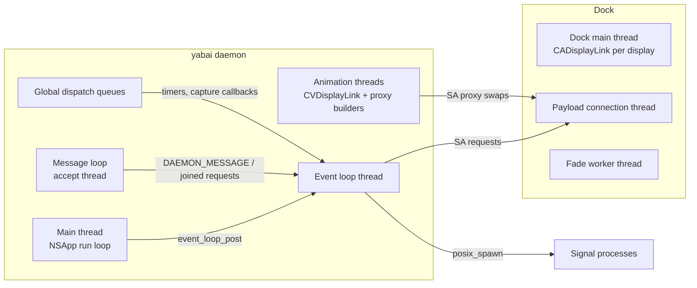

# Architecture

This map describes the daemon, its client and the Dock payload as they stand
on `dev` after lcs.28: which components exist, which thread runs what, how
events flow and who owns each piece of state. It is the starting point for the
refactor at the end, and it lists the risks found while drawing it. Details of
the fork's own features are in [navigation](navigation.md),
[effects](effects.md) and [scripting addition](osax.md).

## Components and processes

| Process | Code | Role |
| --- | --- | --- |
| `yabai` daemon | `src/manifest.m` (unity build) | Window manager: observes applications, windows, Spaces and displays, tiles, answers commands, runs signals. |
| `yabai -m` client | `src/yabai.c` (`client_send_message`) | Sends one command over the daemon socket and prints the reply. `skhd` and `space.sh` start one per key press. |
| Dock payload | `src/osax/payload.m` and fork handlers | Injected into Dock by `yabai --load-sa` (root, `src/osax/loader.m`). Runs Dock-private operations: Space focus, create, move; window order, level, opacity and fades. |
| Signal actions | `src/event_signal*.c` | Shell commands the daemon starts with `posix_spawn` when a subscribed event occurs. |

The two sockets:

- **Daemon socket** `/tmp/yabai_$USER.socket`, created with `bind` and then
  `chmod 0600`. A message is a 4-byte length and NUL-separated tokens
  (`src/message.c`). The daemon answers on the same connection. No peer
  authentication (planned; see the Atrium open threads).
- **Payload socket** in Dock. Each request opens its own connection
  (`scripting_addition_send_bytes`), builds its message in a stack buffer of
  `SA_SOCKET_BUFF_LEN` (4 KiB), the payload's message size, refusing one that
  does not fit, and waits up to one second for Dock to close the connection
  or reply. Dock handles connections one at a time on one
  thread.

## Build structure

The daemon is one translation unit. `src/manifest.m` includes every header,
the core's first and then those of navigation and effects (`effects/*.h`,
`navigation/*.h` and `hooks.h`), then every source file in a fixed order;
several sources include further sources:

```
manifest.m
├── navigation/admission.c, topology.c, activation.c
├── effects/display.m, window_fade.c, snapshot.m ─ snapshot_capture.m, snapshot_surface.m
├── navigation/step.c, schedule.c, command.c
├── sa.m ─ sa_opacity.c
├── mission_control.c
├── event_queue.c, event_loop.c ─ window_focus_events.c, event_loop_trace.c
├── event_signal.c ─ event_signal_process.c
├── workspace.m, rule.c, message.c
├── display.c, space.c, view.c, window.c, process_manager.c, application.c
├── display_manager.c, space_manager.c, window_manager.c, mouse_handler.c
└── yabai.c (main)
```

Consequences:

- Every function and global is visible to everything included after it.
  The core's files call each other's file-static functions by include order.
- Each global is declared once, in the header of the part that owns it, and
  defined in `yabai.c` or `event_loop.c`.
- Each navigation and effects module declares what other files use in its
  header, which also states its threads, the state it owns, its callers and
  what it calls. `hooks.h` declares every module function the core calls,
  grouped by the calling file and handler. What the modules call in the core
  is declared in the core's headers: the command vocabulary, tokens and
  selectors in `message.h`, Mission Control's mode in `mission_control.h`,
  focus in `window_manager.h`. The navigation and effects sources come before
  every core source, so the compiler holds them to what the headers declare.
- Tests include a module's header and source directly and replace its
  dependencies with macros and stubs (`tests/navigation/*.c`).

The payload is built separately for x86_64 and arm64
(`src/osax/{x64,arm64}_payload.m`), then embedded in the daemon as
`payload_bin.c` and `loader_bin.c`.

## Threads



### Daemon

| Thread | Started by | Runs | Writes |
| --- | --- | --- | --- |
| Main | `main` → `[NSApp run]` | Carbon process events (`process_handler`), NSWorkspace and distributed notifications and KVO (`workspace.m`), AX observers per application and for Dock (`application.c`, `mission_control.c`), the mouse event tap (`mouse_handler.c`), display reconfiguration (`display_manager.c`), SkyLight connection notifications (`mission_control.c` `connection_handler`), and retries dispatched to the main queue. | The process table (`g_process_manager`), `mouse_state` click flags, `__last_cmd_tab_time` (atomic). Everything else it only posts as events. |
| Event loop | `event_loop_begin` | Every event handler and every daemon command, one at a time (`event_loop_run`). Signals are spawned at the end of each event (`event_signal_flush`). | All window, space, display, view and rule state; all fork navigation state; every SA request of commands and navigation. |
| Message loop | `message_loop_begin` | `accept` on the daemon socket; the fork's grouping of `space --navigate focus next/prev` requests (`space_navigation_accept`). | `g_space_navigation_queue` (mutex). |
| Global queues | `dispatch_after`, `dispatch_source` | Navigation wake-ups, deferred focus and capture deadlines (post events), the snapshot overlay's alpha timer and its cancel handler, ScreenCaptureKit completion (posts an event for a queued step). | Snapshot state under `space_snapshot_lock`; capture bookkeeping under its own mutex. |
| Animation | `window_manager_animate_window_list` | Upstream window animations: proxy windows built on short-lived threads, frames on a CVDisplayLink thread, which also asks Dock to swap proxies back. | Animation contexts and `window_animations_table` under `window_animations_lock`. |

Startup order (`src/yabai.c`): the event loop thread starts first, then the
process, display and mouse managers, the SkyLight notifications, the window
and space managers, the message loop, and finally the configuration file runs
and the main run loop starts. Main-thread callbacks cannot fire before
`[NSApp run]`, so the managers are complete before the first event; the first
commands can arrive as soon as the message loop starts.

### Dock payload

| Thread | Runs |
| --- | --- |
| Payload connection thread | Accepts one daemon connection at a time and handles its message (`handle_connection` in `payload.m`). |
| Fade worker (fork) | One sleeping worker that writes window-fade frames and watches their deadlines (`window_fade_worker.c`). |
| Dock main thread | Fork display links, one per display, created on Dock's main queue; they wake the worker (`window_fade_display.m`). |

Fork payload state is guarded by `window_fade_lock`; display callbacks only
try the lock, so Dock's main thread never waits for the worker.

## Events

Producers post with `event_loop_post`, which copies the event into a ring
under a mutex (`event_queue.c`) and wakes the consumer with a semaphore. A full
ring doubles, with a warning in the log, so an event loop that falls behind
costs memory rather than events. A mouse move replaces the move queued right
before it.
The 43 event types (`src/event_loop.h`) come from:

| Producer | Events |
| --- | --- |
| Carbon process events (main) | `APPLICATION_LAUNCHED`, `APPLICATION_TERMINATED`, `APPLICATION_FRONT_SWITCHED` |
| NSWorkspace, KVO and distributed notifications (main) | `APPLICATION_LAUNCHED` (once launch finishes), `APPLICATION_VISIBLE/HIDDEN`, `SPACE_CHANGED`, `DISPLAY_CHANGED`, `SYSTEM_WOKE`, `DOCK_DID_RESTART`, `DOCK_DID_CHANGE_PREF`, `MENU_BAR_HIDDEN_CHANGED` |
| AX observers of applications (main) | `WINDOW_CREATED/DESTROYED/FOCUSED/MOVED/RESIZED/MINIMIZED/DEMINIMIZED/TITLE_CHANGED`, `MENU_OPENED/CLOSED` |
| AX observer of Dock (main) | `MISSION_CONTROL_SHOW_ALL_WINDOWS/SHOW_FRONT_WINDOWS/SHOW_DESKTOP`, `MISSION_CONTROL_EXIT` |
| SkyLight notifications (main) | `SLS_WINDOW_ORDERED/DESTROYED`, `SLS_SPACE_CREATED/DESTROYED`, `MISSION_CONTROL_ENTER` |
| Display reconfiguration (main) | `DISPLAY_ADDED/REMOVED/MOVED/RESIZED` |
| Mouse tap (main) | `MOUSE_DOWN/UP/DRAGGED/MOVED` (moves only with `focus_follows_mouse`) |
| Message loop | `DAEMON_MESSAGE` |
| Navigation timers (global queues) | `SPACE_NAVIGATION_FOCUS`, `SPACE_NAVIGATION_DISPATCH`, and `SPACE_NAVIGATION_CAPTURED` at a capture's deadline |
| ScreenCaptureKit completion | `SPACE_NAVIGATION_CAPTURED` |
| Handlers themselves | Directly: `APPLICATION_FRONT_SWITCHED` and `WINDOW_FOCUSED` that arrived before their application or window was known. Through the main queue, 100 ms later: `APPLICATION_LAUNCHED` retries, `MISSION_CONTROL_CHECK_FOR_EXIT`, `MISSION_CONTROL_EXIT`. |

Ordering is FIFO; a merged mouse move keeps the place of the one it
replaced. Object lifetimes rely on it: the main thread posts
`APPLICATION_TERMINATED` after every earlier event about that process, and
only that handler frees it. Handlers taking more than 10 ms emit a signpost
(category `events`, `event_loop_trace.c`).

## State and ownership

| State | Owner | Other access |
| --- | --- | --- |
| `g_window_manager` (windows, applications, focus, opacity, animation settings) | Event loop | Animation threads read their own contexts; `window_animations_table` is locked. |
| `g_space_manager`, views and their BSP trees | Event loop | — |
| `g_display_manager` | Event loop | Display reconfiguration callback only posts. |
| `g_process_manager.process` (table) | Main thread | Event loop receives `struct process *` through events; main-queue retries look processes up on the main thread. |
| `g_mouse_state` | Split: settings written by commands on the event loop, click state by the tap on the main thread | The tap reads `modifier` without synchronization (a benign race upstream). |
| `g_event_loop.queue` | Event loop takes events | Every producer adds them; mutex. |
| `g_signal_storage` | Event loop | — |
| `g_space_navigation_queue` (fork) | Message loop and event loop | Mutex. |
| `g_space_navigation_schedule`, `_focus`, `_anchor`, `_spaces` (fork) | Event loop | Timers only post events. |
| Snapshot (`space_snapshot_active`, recent Spaces) | Event loop creates and cancels | Alpha timer on a global queue, under `space_snapshot_lock`; the timer's cancel handler frees the snapshot without the lock. |
| Capture bookkeeping (`space_snapshot_captures`) | Event loop begins | ScreenCaptureKit completion ends it; own mutex, reference-counted capture. |
| Capture a step waits for (`space_snapshot_pending`, `space_navigation_flight`) | Event loop | ScreenCaptureKit completion and the deadline timer only post `SPACE_NAVIGATION_CAPTURED`; the capture's image is handed over through its semaphore. |
| `__pending_window_focus_id` (fork) | Event loop | Atomic. |

## Upstream subsystems

- **Processes and applications** (`process_manager.c`, `application.c`,
  `workspace.m`): which applications exist, their AX observers and launch
  state.
- **Windows** (`window.c`, `window_manager.c`, 3,900 lines together): the
  window table, eligibility, rules, focus, frames, opacity, borders
  (JankyBorders notifications), animations.
- **Spaces and views** (`space.c`, `space_manager.c`, `view.c`): Desktop
  queries through SkyLight, one view (layout and BSP tree) per Space, Space
  commands through the payload.
- **Displays** (`display.c`, `display_manager.c`).
- **Commands** (`message.c`, 3,000 lines): parsing and every domain
  (`config`, `display`, `space`, `window`, `query`, `rule`, `signal`).
- **Signals** (`event_signal.c`): subscriptions and spawning.
- **Mouse** (`mouse_handler.c`): modifier drags, drops and focus follows mouse.
- **Mission Control** (`mission_control.c`): its modes and the SkyLight
  notification callback.
- **Scripting addition** (`sa.m`, `osax/`): install, load, and one request
  function per Dock operation.

## Fork subsystems

Navigation (`space --navigate`), in the order a request travels:

1. **Admission** (`navigation/admission.c`, message loop): recognises
   `focus next|prev` from the raw bytes, groups requests that arrive while one
   waits, tells repeats (under 75 ms) from presses, answers joined requests at
   once.
2. **Command** (`navigation/command.c`, event loop): parses the request,
   takes one snapshot of the Desktops, claims the group's steps and queues.
3. **Schedule** (`navigation/schedule.c`, event loop, pure logic with
   injected clock and executor): bounded queue, rhythm, effect and activation
   waits, overflow jumps, which step activates or settles.
4. **Step** (`navigation/step.c`, event loop): plans (destination, window,
   raise), prepares the effect, asks Dock to switch, starts the effect,
   activates. A queued crossfade step returns after requesting its capture;
   `SPACE_NAVIGATION_CAPTURED`, from the capture's callback or its 150 ms
   deadline, switches and activates, and the schedule starts nothing else
   meanwhile.
5. **Activation** (`navigation/activation.c`, `window_focus_events.c`):
   focus without the upstream 40 ms sleep, raise for applications with windows
   on other displays, the observed focus that spares an AX query.
6. **Topology** (`navigation/topology.c`): one WindowServer snapshot per
   request answers order, display, visibility and type.

Effects:

- **Snapshot crossfade** (`effects/snapshot*.m`): the capture
  (`snapshot_capture.m`), the owned overlay window in an auxiliary Space
  (`snapshot_surface.m`), its alpha timer and cancellation (`snapshot.m`).
- **Window fade** (`effects/window_fade.c`, `sa_opacity.c`, payload
  `window_fade*.c`): the older per-window fade and the opacity policy.
- **Display facts** (`effects/display.m`): the refresh interval effects are
  timed with, and Reduce Motion.

Diagnostics: signposts in subsystem `com.lcs.yabai`, categories
`navigation`, `events` and `effects`.

## Risks found while mapping

| # | Where | Risk | Severity |
| --- | --- | --- | --- |
| 1 | `space_snapshot_cancel_locked` | Read the snapshot after its cancel handler could free it; crashed lcs.25. | Fixed in lcs.26 |
| 2 | Event queue and signal storage | The events' memory pool wrapped to its start without checking that the consumer was past it: a stall with about 21,000 events posted would have overwritten unread ones. Signals of one event were written without a bound. | Fixed after lcs.28: a ring that grows (`event_queue.c`), consecutive mouse moves merged, a signal that does not fit dropped with a warning |
| 3 | `sa.m` request builders | `pack` never checked the 4 KiB buffer: requests with one entry per window (`move_window_list_to_space`, proxy swaps, `order_window_in`) overflowed the stack past roughly 500 to 1,000 windows. | Fixed after lcs.28: a request that does not fit is refused |
| 4 | Event loop | Everything runs on one thread, and some calls wait for others: on a Space change upstream revalidates windows and sets frames over AX (about 1.1 s of busy time in a 45-second sample of bursts), activation waits for WindowServer (about 40 ms on average over 16 activations), Dock up to 1 s. A paced crossfade no longer waits for its capture; drawing the image and one refresh remain, with the switch and the activation, and with pacing off the capture (up to 150 ms) as well. On two 4K displays (20 Mpx each) with lcs.28 that part held the loop a median 132 ms per step (p90 435 ms). | Performance; bounded by timeouts |
| 5 | Daemon socket | A fixed name in the shared `/tmp`: another local user who creates it first stops the daemon from binding. It is made `0600` only after `bind`, which matters with a permissive umask. No peer authentication. | Security; local |
| 6 | TCC | Grants of a bare binary follow its path; every store path asked again and ran without crossfades until restart. | Fixed in Dotfiles `9a8fb78`; the grants survived the update to lcs.28 |
| 7 | Upstream animations and navigation | The CVDisplayLink thread and the event loop both send Dock requests; Dock serialises them, but nothing orders a proxy swap against a navigation switch. | Unverified; watch |
| 8 | Unity build | Hidden coupling through include order and file-static globals, so a module's inputs and threads are not visible where it is used. Navigation and effects now declare their interfaces, threads and state in headers and compile before the core; the core's files still call each other's file-static functions by include order. | Maintainability; reduced |

## Upstream integration

`master` mirrors asmvik/yabai. From now on its changes are not merged
wholesale: new commits by Åsmund Vikane (`koekeishiya`, `Åsmund Vikane`) are
reviewed and ported when they add something the fork lacks. Upstream releases
are rare. This frees the refactor from preserving upstream's file layout. Every
Monday the `sync-upstream` workflow fast-forwards `master` and lists the
author's new commits, oldest first, in the open issue labelled `upstream`
(creating it when none is open); close the issue once every commit is
handled. Commits by other contributors are not reported.

## Refactor plan

Goals: explicit module boundaries, the threads each module runs on written in
its header, and seams for tests that do not depend on include order. Each step
keeps behaviour, passes the existing tests and the live burst checks, and
lands as its own commits.

1. Done. **Headers for the fork's modules**, keeping the unity build:
   `navigation/admission`, `navigation/schedule`, `navigation/step`,
   `navigation/activation`, `navigation/topology`, `effects/snapshot`
   (capture and overlay separately), `effects/window_fade`. Each header
   states its thread and the state it owns. Callers in upstream files go
   through one hook header instead of forward declarations.
2. Done. **Split the step** into plan, switch and activate. This is also what
   the asynchronous capture needs: plan and capture start, the capture
   callback posts an event, and switch and activation run from it, so the
   event loop no longer waits for ScreenCaptureKit. Only paced steps capture
   this way; with pacing off a request still waits.
3. Done. **One header for private SkyLight and AX declarations**: the daemon's
   are in `misc/extern.h`; the payload keeps its own in `osax/payload.m`.
4. Done. **Fix risks 2 and 3**: the event queue copies each event into a
   ring under a mutex and doubles it when full, reporting the growth.
   Dropping an event instead would leak what it carries or leave a client
   waiting, and with consecutive mouse moves merged the ring grows only with
   what the user does. `pack` refuses a request that does not fit.
5. Done. **Remove the legacy Space crossfade** from the payload and the
   protocol: payload `2.1.31-lcs.13` drops about 630 lines and opcode `0x16`,
   which stays reserved; loading it needs a scripting-addition reload.
6. **Upstream files where it pays**: `message.c` by command domain,
   `window_manager.c` by concern (table and rules, focus, frames, animation),
   and the Space-change revalidation that holds the event loop.
7. Done. **Workflow**: `sync-upstream` reports new commits by the author in
   an issue instead of proposing a merge.

Order: 1 and 3 first (mechanical, low risk), then 2 with the asynchronous
capture, then 4 and 5, then 6 as findings justify.
